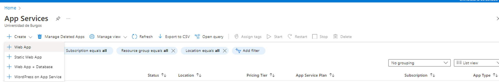
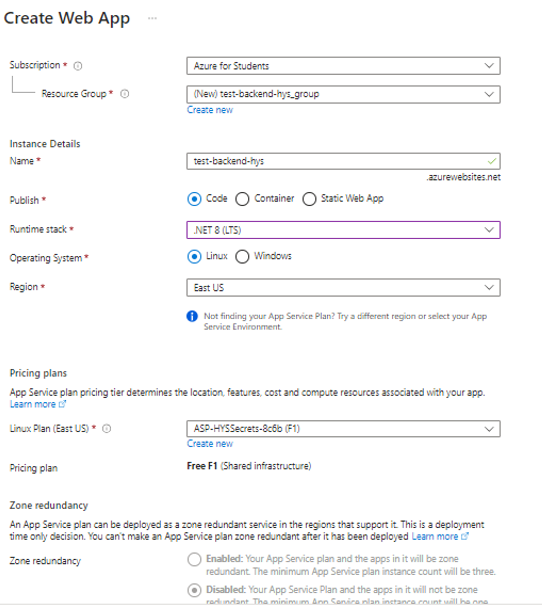
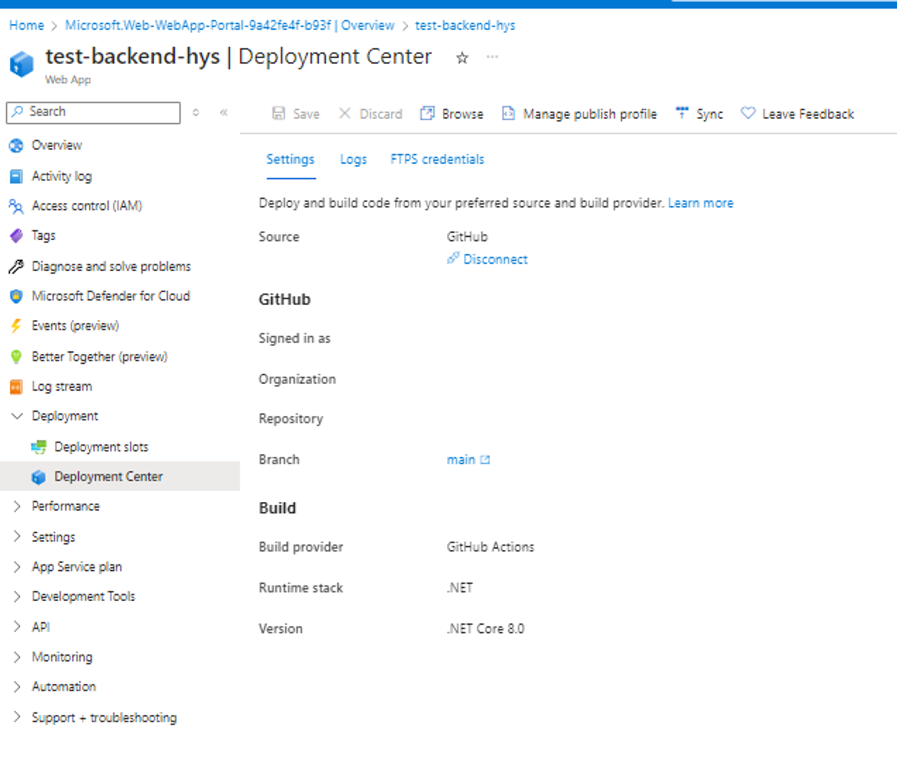
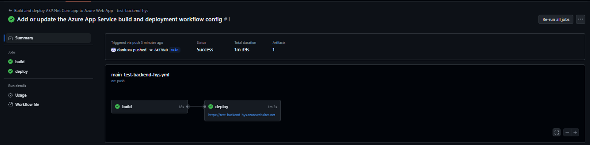
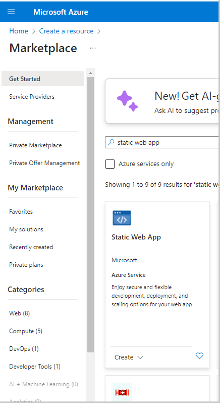
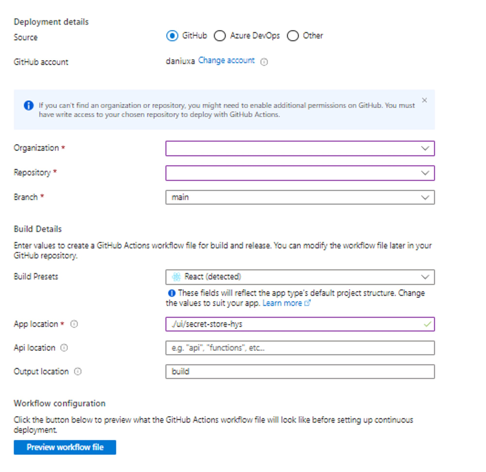
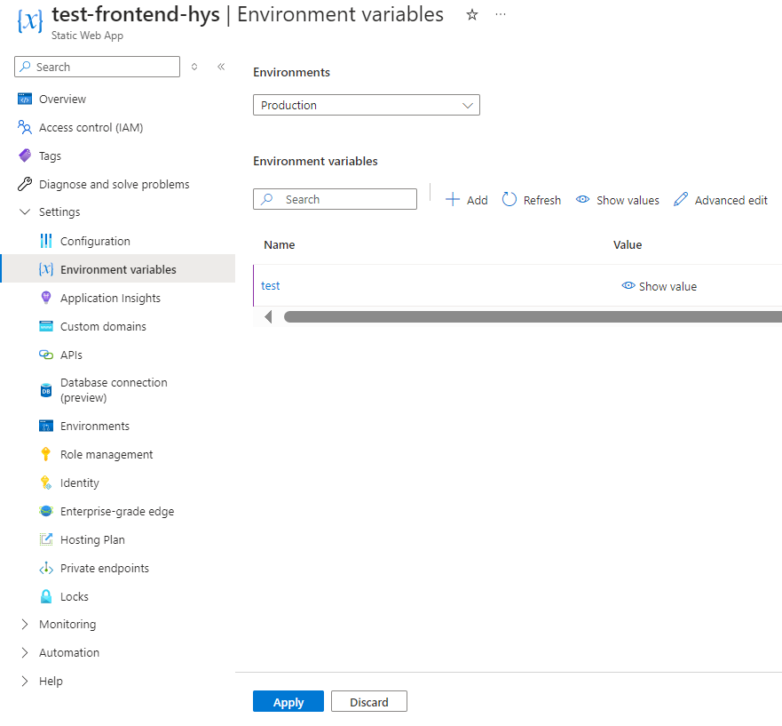
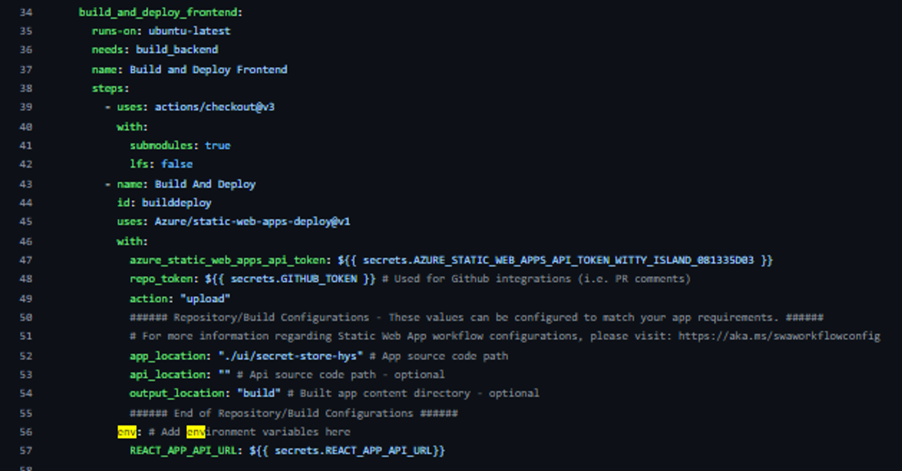

# Secret store

[](https://github.com/bice4/shs/actions/workflows/main_secret-store.yml)

## :bookmark_tabs: Introduction

This pet project shows how to use Azure infrastructure to deploy .NET backend and React UI app.
It includes the following:

- `SecretStoreHys.Api` - ASP .NET Core app
- `ui/secret-store-hys` - React app
- `ui/mockserver` - simple mock server to play with the UI locally
- `github/workflows` - .yaml files to build BE and UI, deploy to Azure

BE using Azure AppService resource
UI using Azure StaticWebApps resource

## :desktop_computer: What it does

Suppose you need to share some sensitive information and you really don't want to send encrypted data and key in one message. You can create a secret easily with Secret Store. All you have to do is provide the content, the pin and the expiration date. BE will encrypt your content with the pin you have provided. **Secret store does not do any storage/logging of pin code.**

## :cloud: Deployment on Azure

### :factory: Backend Deployment Process

To deploy your back-end application on Azure, you need to follow these steps:

1. **Create an Azure resource called 'Web App'.** In Azure, select App Service and create a web application. Fill in all the required information and click 'Review and Create'. See attached images below:




2. **Generate deployment file.**  Once the web application has been created, go to the Deployment Centre. Connect to your github account -> select your repository and branch, and click the 'Save' button. See attached image below:



A .yml file containing the script to deploy your backend to Azure will be generated in your repository on GitHub. You will find the workflow that shows the status of your application deployment on Azure on the Actions page. See attached image below:



### :wedding: Frontend deployment

You need to follow these steps to deploy the front-end part of your application to Azure:

1. **Create Static Web App.** Go to Create Resource and find 'Static Web App' in the Azure portal.



2. **Deployment.**  On the creation page, choose your GitHub account, repository, and the location of your front-end application. Then create it. See attached image below:



Once the static web application is created, go to your repository on GitHub. There you will find the .yml file with the script to deploy your front-end to Azure. On the Actions page, you will have the workflow that shows the status of your application deployment on Azure.

#### **Additional configuration of your front-end application**

1. **Configure environment variables**
If you want to use environment variables (e.g. the URL of the API), you can provide them in one of two ways:

    - Make the variable available on Azure in your Static Web APP page. All you need to do is select Environment, enter the variable and click Apply. See attached image below:

    

    - In the .yml file, provide the environment variable. You should update the script and add the env section containing the variable names and values. In the example, we can see that the variable has been taken from the secrets repository on GitHub. See attached image below:

    

## :vhs: Deployment on VPS

### :factory: Backend Deployment Process

 Deploying applications without using Azure or similar cloud services can be more complicated due to the need to handle many infrastructure tasks manually.

1. **Push Docker Container to a Registry:**
   - Ensure your backend application is containerized using Docker.
   - Push your Docker image to a container registry like Docker Hub, Amazon ECR, or any other preferred registry:
    ```bash
    docker build -t your-image-name .
    docker tag your-image-name your-dockerhub-username/your-image-name
    docker push your-dockerhub-username/your-image-name
    ```

2. **Purchase or Rent a VPS:**

   - Acquire a Virtual Private Server (VPS) from providers such as DigitalOcean, AWS EC2, Linode, or any other VPS provider.
  
3. **Install Docker on Your VPS:**

   - If Docker is not pre-installed, install Docker manually:
    ```bash
    sudo apt-get update
    sudo apt-get install -y docker.io
    sudo systemctl start docker
    sudo systemctl enable docker
    ```

4. **Login to Your Container Registry:**

   - Log in to your container registry from your VPS:
    ```bash
    docker login -u your-dockerhub-username -p your-dockerhub-password
    ```

5. **Pull Your Docker Image:**

   - Pull your Docker image from the registry:
    ```bash
    docker pull your-dockerhub-username/your-image-name
    ```

6. **Start the Docker Container:**

   - Start the container with forwarded ports and the correct volume configuration:
    ```bash
    docker run -d -p host-port:container-port --name your-container-name your-dockerhub-username/your-image-name
    ```

7. **Open Ports in the Host Operating System:**

- Ensure the necessary ports are open in your VPS’s firewall settings. For Ubuntu, use ufw:
    ```bash
    sudo ufw allow host-port
    ```

8. **Open Ports in Your VPS Provider:**

   - If applicable, configure the security group or firewall settings in your VPS provider’s dashboard to allow traffic on the necessary ports.

### :wedding: Frontend Deployment Process

1. **Build the React Application:**

   - Build your React application:

    ```bash
    npm run build
    ```

2. **Zip the Build Folder:**

   - Compress the build folder:
    ```bash
    zip -r build.zip build
    ```

3. **Install NGINX on Your VPS:**
    ```bash
    sudo apt-get update
    sudo apt-get install -y nginx
    ```
4. **Copy Your Build Folder to NGINX:**

   - Copy the contents of your build folder to the appropriate directory for NGINX:
    ```bash
    Copy code
    sudo unzip build.zip -d /var/www/your-app
    ```

5. **Update NGINX Configuration:**

   - Update NGINX configuration to serve your UI application. Edit the NGINX config file (e.g., /etc/nginx/sites-available/default):
    ```nginx
    server {
        listen 80;
        server_name your-domain.com;

        location / {
            root /var/www/your-app;
            index index.html;
            try_files $uri /index.html;
        }
    }
    ```
6. **Restart NGINX to apply the changes:**
    ```bash
    sudo systemctl restart nginx
    ```

### :construction: Backend Update Procedure

1. **Stop the Running Container:**

   - Stop the current container:
    ```bash
    docker stop your-container-name
    ```

2. **Pull the New Version of Your Image:**

   - Pull the updated Docker image:
    ```bash
    docker pull your-dockerhub-username/your-image-name
    ```
    
3. **Start the New Container:**

   - Start the new container:
    ```bash
    docker run -d -p host-port:container-port --name your-container-name your-dockerhub-username/your-image-name
    ```

### :construction_worker: Frontend Update Procedure

1. **Copy the New Build to the NGINX Folder:**
   
   - Replace the old build with the new build:
    ```bash
    Copy code
    sudo rm -rf /var/www/your-app/*
    sudo unzip new-build.zip -d /var/www/your-app
    ```
   - No need to restart NGINX as static files will be served immediately.
  
By following these steps, you can deploy and update your backend and frontend applications on a VPS without relying on Azure resources. This setup ensures that your applications are served correctly and efficiently from your chosen VPS provider.

Deploying without Azure or similar cloud services requires more manual intervention, careful planning, and a deeper understanding of infrastructure management. While it can offer more control and potentially lower costs, it also demands significant time and expertise to ensure a reliable and secure deployment.